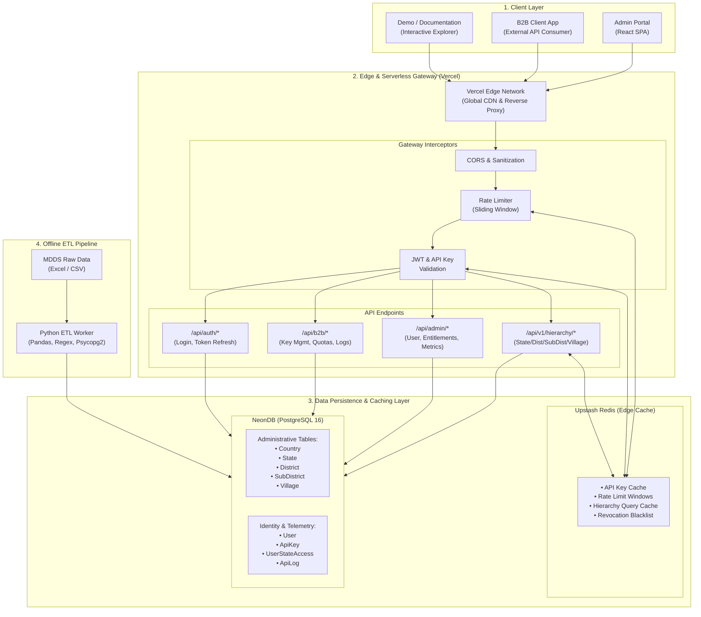
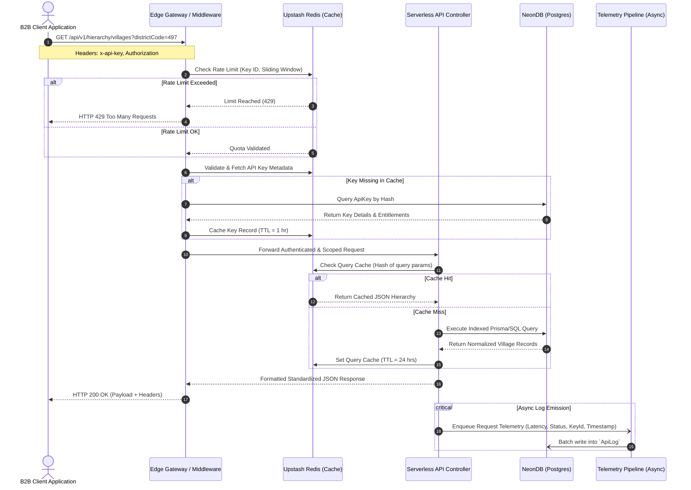
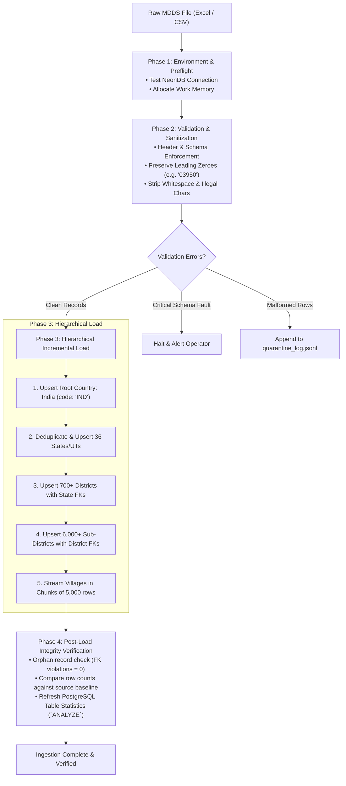
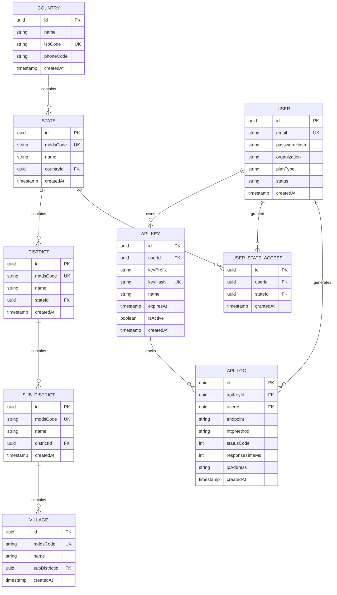

# Engineering Design Document: Phase 1 Architecture & Database Specification

**Project:** MDDS Administrative Hierarchy & B2B Location Intelligence Platform  
**Document Version:** 1.0.0  
**Phase:** Phase 1 — Technical Architecture, Relational Schema & Data Pipeline  
**Target Completion:** September 3, 2026  
**Status:** In Progress (Active) — Baseline Review  
**Owners / Team:** Harshith Kumar (HH), Riyan Pathan (RI), Geetha (YG)

---

## 1. Executive Summary & Objective

This document formalizes the technical blueprint for the **MDDS Administrative Hierarchy & B2B Location Intelligence Platform**. The platform processes over 600,000 administrative divisions across India (from States down to individual Villages) based on the Ministry of Drinking Water and Sanitation (MDDS) standardization dataset. 

The primary business goals are:
1. **High-throughput, low-latency REST APIs** for enterprise address validation, hierarchical lookups, and fuzzy location search.
2. **Robust multi-tenant access control** permitting B2B clients to access administrative boundaries scoped by tier, state entitlement, and rate limits.
3. **An automated, idempotent ETL ingestion pipeline** capable of loading and validating ~650,000 raw MDDS records into a 3NF relational database without data drift or orphaned nodes.

---

## 2. Technical Architecture

### 2.1 Technology Stack Decision Matrix

The stack selections prioritize **developer velocity, serverless scalability, low edge latency, and strict relational integrity**.

| Layer / Component | Technology Selected | Architectural Justification | Trade-offs & Mitigations |
| :--- | :--- | :--- | :--- |
| **Backend Runtime** | **Node.js (LTS) + Express.js** | Non-blocking asynchronous I/O optimized for network-bound REST queries, lightweight microservices, and deep ecosystem support. | Single-threaded compute. *Mitigation:* Heavy computation (ETL) is decoupled into dedicated Python worker scripts. |
| **Primary Database** | **NeonDB (PostgreSQL 16)** | Serverless PostgreSQL with instant scale-to-zero, fast branch environments, native pgBouncer connection pooling, and rich index support. | Cold starts on idle compute. *Mitigation:* Neon keeps warm pools; Upstash Redis handles frequent queries before hitting DB. |
| **ORM / Data Access** | **Prisma ORM** | Fully type-safe client, declarative migrations, declarative relations, and auto-generated TypeScript typings. | Performance overhead on large batch inserts. *Mitigation:* Batch ingestion uses raw SQL / bulk inserts; Prisma handles transactional API logic. |
| **Frontend Framework** | **React.js (v18+) + Vite** | Instant HMR build times, declarative UI, component-driven architecture, and zero-bundle bloat. | Client-side bundle size. *Mitigation:* Route-level code splitting and tree-shaking via Vite. |
| **Analytics & Charts** | **Recharts** | Declarative, SVG-based charting library tailored for React, lightweight footprint, and zero D3 imperative boilerplate. | High DOM element counts on large datasets. *Mitigation:* Aggregated query payloads before sending to the client. |
| **Caching Layer** | **Upstash Redis** | Serverless Redis with sub-millisecond edge latency, REST API connection support over HTTP (avoids TCP socket limits on serverless functions). | Volatile memory limits. *Mitigation:* Configured with strict TTLs (24h on static hierarchies) and LRU eviction policy. |
| **Rate Limiting** | **Distributed Sliding Window (Redis)** | Region-agnostic rate limiting across Vercel edge lambdas to enforce tier-based quotas (Requests/Min and Daily Quotas). | Redis network call per request. *Mitigation:* In-memory fallback if Redis is momentarily unreachable. |
| **Security & Auth** | **JWT (Stateless) + Bcrypt** | Standardized, cryptographically signed bearer tokens for dashboard sessions; salted SHA-256 / bcrypt hashing for B2B API secret validation. | Token revocation complexity. *Mitigation:* Short-lived access tokens (15m) + Redis-backed revocation blacklist for emergency API key disabling. |
| **Edge & Hosting** | **Vercel Edge Network** | Global CDN distribution, automated CI/CD pipelines, integrated preview deployments, and zero-maintenance serverless execution. | Maximum execution time limit (15-60s). *Mitigation:* Long-running ingestion jobs run in independent worker environments. |

---

### 2.2 System Architecture Diagram

The system operates across three decoupled layers: **Client Layer**, **Edge / API Gateway Layer**, and **Data Persistence Layer**.

#### Visual Architecture Diagram



---

### 2.3 Comprehensive Data Flow Patterns

#### Pattern A: B2B API Query Lifecycle



#### Pattern B: Ingestion Pipeline Lifecycle



---

## 3. Database Design & Relational Schema

### 3.1 Normalization Strategy (Third Normal Form - 3NF)

The database strictly adheres to **3NF** to prevent update anomalies, optimize storage footprint, and support enterprise-scale queries:
1. **1NF (First Normal Form):** Every column holds atomic, scalar values. Complex address strings are decomposed into structured attributes (State, District, SubDistrict, Village).
2. **2NF (Second Normal Form):** Every non-key attribute is fully functionally dependent on the table's primary key, eliminating partial dependencies.
3. **3NF (Third Normal Form):** All transitive dependencies are removed. A Village does not store state or country references directly; it links to `SubDistrict`, which references `District`, which in turn references `State` and `Country`.
4. **Hierarchical Lineage:** Each administrative tier maintains strict parent-child foreign key constraints (`ON DELETE RESTRICT`) to prevent accidental deletion of parent jurisdictions with active child entities.

---

### 3.2 Entity Relationship Summary & Data Dictionary



#### Detailed Table Specifications

| Table Name | Primary Purpose | Key Fields | Foreign Keys / Constraints |
| :--- | :--- | :--- | :--- |
| **`Country`** | Top-level jurisdictional root enabling future multi-country expansion. | `id`, `name`, `isoCode`, `phoneCode` | Unique(`isoCode`) |
| **`State`** | Represents States and Union Territories. | `id`, `mddsCode`, `name`, `countryId` | FK -> `Country(id)`, Unique(`mddsCode`) |
| **`District`** | First-level administrative subdivision within a State. | `id`, `mddsCode`, `name`, `stateId` | FK -> `State(id)`, Unique(`mddsCode`) |
| **`SubDistrict`** | Taluka / Tehsil / Block-level administrative entity. | `id`, `mddsCode`, `name`, `districtId` | FK -> `District(id)`, Unique(`mddsCode`) |
| **`Village`** | Granular revenue village or locality (~600k+ rows). | `id`, `mddsCode`, `name`, `subDistrictId` | FK -> `SubDistrict(id)`, Unique(`mddsCode`) |
| **`User`** | B2B tenant accounts, developers, and platform administrators. | `id`, `email`, `passwordHash`, `organization`, `planType`, `status` | Unique(`email`), Enum(`planType`, `status`) |
| **`ApiKey`** | Cryptographic credentials used by B2B applications to query the API. | `id`, `userId`, `keyPrefix`, `keyHash`, `isActive`, `expiresAt` | FK -> `User(id)`, Unique(`keyHash`) |
| **`UserStateAccess`** | Granular row-level security table limiting API client visibility to approved States. | `id`, `userId`, `stateId`, `grantedAt` | FK -> `User(id)`, FK -> `State(id)`, Unique(`userId`, `stateId`) |
| **`ApiLog`** | Immutable append-only audit trail for billing, quotas, and analytics. | `id`, `apiKeyId`, `userId`, `endpoint`, `statusCode`, `responseTimeMs`, `createdAt` | FK -> `ApiKey(id)`, FK -> `User(id)` |

---

### 3.3 Indexing Strategy & Query Optimization

To maintain sub-50ms API response times across 600,000+ village records, specific index types are assigned based on access patterns:

| Table | Targeted Column(s) | Index Method | Justification & Query Pattern |
| :--- | :--- | :--- | :--- |
| **`Village`** | `name` | **GIN (`gin_trgm_ops`)** | Powers ultra-fast partial string matching and autocomplete (`WHERE name ILIKE '%mani%'`). Supported by `pg_trgm` extension. |
| **`Village`** | `subDistrictId` | **B-Tree** | Standard single-column index to support fast parent-child joins during hierarchical address resolution. |
| **`Village`** | `(subDistrictId, name)` | **Composite B-Tree** | Optimizes filtered directory listings within a specific sub-district. |
| **`SubDistrict`** | `districtId` | **B-Tree** | Accelerates multi-table joins from State -> District -> SubDistrict. |
| **`District`** | `stateId` | **B-Tree** | Accelerates state-level district lookups. |
| **`ApiKey`** | `keyHash` | **Hash / B-Tree Unique** | $O(1)$ constant-time lookup during API request authentication middleware. |
| **`ApiLog`** | `(createdAt DESC, userId)` | **Composite B-Tree** | Accelerates time-series analytics dashboards, billing aggregations, and recent query lookups. |

---

### 3.4 Canonical Data Relationship Hierarchy

The real-world mapping derived from the MDDS source dataset demonstrates strict hierarchical parent-child relationships:

```
State: Maharashtra (MDDS STC: "27")
 └── District: Nandurbar (MDDS DTC: "497")
      └── SubDistrict: Akkalkuwa (MDDS Sub_DT: "03950")
           ├── Village: Manibeli   (MDDS PLCN: "525002")
           ├── Village: Dhankhedi  (MDDS PLCN: "525003")
           ├── Village: Chimalkhadi (MDDS PLCN: "525004")
           └── Village: Sinduri    (MDDS PLCN: "525005")
```

> **Data Integrity Notice on Code Formats:**  
> All MDDS codes (STC, DTC, Sub_DT, PLCN) must be stored as **`VARCHAR`** data types, **never integer**. Numeric casting drops critical leading zeroes (e.g., Sub-District code `"03950"` would incorrectly become `"3950"`), corrupting government code compliance.

---

### 3.5 Future-Proofing & Enterprise Governance

1. **International Domain Support:** The top-level `Country` entity decouples Indian administrative naming conventions from the core architecture, allowing seamless expansion to other sovereign datasets (e.g., ISO-3166 administrative levels).
2. **Auditability & Traceability:** All entities include `createdAt` and `updatedAt` timestamps maintained via database triggers or Prisma middleware.
3. **Soft-Delete Architecture:** Sensitive records (`User`, `ApiKey`) utilize an `isActive` boolean flag and an optional `deletedAt` timestamp to prevent cascading data loss while retaining historical telemetry associations.
4. **Row-Level Security (RLS) & State-Based Scoping:** B2B clients subscribed only to specific regional data (e.g., only Maharashtra or Gujarat) are restricted at the database query layer via `UserStateAccess` joins.

---

## 4. High-Volume MDDS Data Ingestion Strategy

### 4.1 Source Dataset Specification

| MDDS Column Field | Semantic Meaning | Target Table & Column | Format / Transformation Rules |
| :--- | :--- | :--- | :--- |
| `MDDS STC` | State Code | `State.mddsCode` | String(2), left-padded with zero if single digit. |
| `STATE NAME` | State Title | `State.name` | Normalized to Title Case; trailing whitespace trimmed. |
| `MDDS DTC` | District Code | `District.mddsCode` | String(3-4), sanitized. |
| `DISTRICT NAME` | District Title | `District.name` | Normalized to Title Case; special characters escaped. |
| `MDDS Sub_DT` | Sub-District / Taluka Code | `SubDistrict.mddsCode` | String(5), mandatory zero-padding preserved (e.g., `"03950"`). |
| `SUB-DISTRICT NAME` | Sub-District Title | `SubDistrict.name` | Normalized to Title Case. |
| `MDDS PLCN` | Village / Locality Code | `Village.mddsCode` | String(6), globally unique revenue village identifier. |
| `Area Name` | Village / Area Title | `Village.name` | Normalized; unicode characters validated. |

---

### 4.2 Scale & Volume Estimates

| Administrative Level | Approximate Entity Count | Ingestion Strategy | Memory Footprint |
| :--- | :--- | :--- | :--- |
| **Country** | 1 (India) | Single idempotent upsert | Negligible (<1 KB) |
| **States / UTs** | 36 | Single in-memory dictionary | < 5 KB |
| **Districts** | 700+ | Pre-cached foreign key map | < 100 KB |
| **Sub-Districts** | 6,000+ | Pre-cached foreign key map | < 1.5 MB |
| **Villages** | **600,000+** | **Batched Streaming (5,000 records/chunk)** | ~150 MB buffer |
| **Total Rows** | **~650,000** | **Total Ingestion Window: < 4 minutes** | Streamed chunking |

---

### 4.3 4-Phase Ingestion Workflow

```
[Phase 1: Preflight] ──> [Phase 2: Validation] ──> [Phase 3: Bulk Upsert] ──> [Phase 4: Audit & Verify]
```

#### Phase 1: Environment Setup & Preflight
- Verify NeonDB PostgreSQL connection pool and compute autoscaling settings.
- Ensure database extensions are activated:
  ```sql
  CREATE EXTENSION IF NOT EXISTS "uuid-ossp";
  CREATE EXTENSION IF NOT EXISTS "pg_trgm";
  ```
- Validate presence of Python 3.11+ environment with verified dependencies: `pandas`, `openpyxl`, `psycopg2-binary`, `pydantic`.

#### Phase 2: Streamed Data Validation & Cleansing
- Stream raw records in chunks of 50,000 using Python Generators to prevent Out-Of-Memory (OOM) errors.
- Enforce schema validation on each record:
  - Reject records with missing `MDDS PLCN` or blank names.
  - Trim extraneous whitespace, carriage returns, and control characters.
  - Enforce string typing on all code columns to preserve leading zeros.
- Route any anomalous records to `quarantine_records.jsonl` with error codes (`ERR_NULL_CODE`, `ERR_INVALID_HIERARCHY`).

#### Phase 3: Incremental Parent-Cached Load
To achieve maximum ingestion speed without firing millions of individual `SELECT` queries:
1. **Root Insertion:** Upsert `Country` (`name: 'India', isoCode: 'IND'`).
2. **State Layer:** Extract unique States, upsert against `State.mddsCode`, and store mapping `state_code -> state_uuid` in an in-memory hash table.
3. **District Layer:** Extract unique Districts, attach `state_uuid` from cache, upsert against `District.mddsCode`, and cache `district_code -> district_uuid`.
4. **Sub-District Layer:** Extract unique Sub-Districts, attach `district_uuid`, upsert, and cache `subdistrict_code -> subdistrict_uuid`.
5. **Village Layer:** Stream village records in chunks of **5,000**, resolve `subDistrictId` from the in-memory cache, and bulk-insert using `psycopg2.extras.execute_values` or PostgreSQL `COPY` buffer.

#### Phase 4: Data Integrity Verification & Health Gate
Post-load automated queries must return strictly expected integrity metrics:
```sql
-- 1. Verify No Orphaned Villages Exist
SELECT count(*) FROM "Village" v 
LEFT JOIN "SubDistrict" sd ON v."subDistrictId" = sd.id 
WHERE sd.id IS NULL; -- Expected: 0

-- 2. Verify Distinct Hierarchy Counts
SELECT 
    (SELECT count(*) FROM "State") AS total_states,
    (SELECT count(*) FROM "District") AS total_districts,
    (SELECT count(*) FROM "SubDistrict") AS total_subdistricts,
    (SELECT count(*) FROM "Village") AS total_villages;

-- 3. Update Query Optimizer Statistics
VACUUM ANALYZE "Village";
VACUUM ANALYZE "SubDistrict";
```

---

### 4.4 Resilient Error Handling & Quarantine Strategy

To guarantee zero silent data loss, the ETL pipeline implements a **Dead-Letter / Quarantine Pattern**:
1. **Non-Fatal Fault Isolation:** A malformed village record does not terminate the batch. The failed row is skipped, flagged with an incident timestamp and reason, and logged to `import_errors.jsonl`.
2. **Atomic Chunk Transactions:** Each 5,000-village batch runs within a single PostgreSQL transaction block (`BEGIN ... COMMIT`). If a database socket or disk fault occurs, only that chunk rolls back and retries with exponential backoff.
3. **Post-Import Quarantine Reconciliation:** At the conclusion of the ETL run, an automated reconciliation summary is generated:
   - Total Rows Processed
   - Successfully Upserted Entities (State, District, SubDistrict, Village)
   - Quarantined Records Count with categorized error codes
   - Execution duration and memory watermark

---

## 5. Phase 1 Milestone Verification & Checklist

| Deliverable / Task | Acceptance Criteria | Target Date | Owner | Status |
| :--- | :--- | :--- | :--- | :--- |
| **Technology Matrix & Architecture** | Architecture review approved; system boundary diagram finalized. | Aug 28, 2026 | Team | **DONE** |
| **Prisma Schema Definition** | Complete 3NF Prisma schema file created with relations and constraints. | Aug 30, 2026 | Harshith (HH) | **DONE** |
| **NeonDB & Upstash Setup** | Serverless DB and Redis instances provisioned; connection string verified. | Sep 01, 2026 | Riyan (RI) | **IN PROGRESS** |
| **Python ETL Ingestion Script** | Streamed parser with in-memory caching and batch copy tested on sample data. | Sep 02, 2026 | Geetha (YG) | **IN PROGRESS** |
| **Full MDDS Load & Verification** | 600,000+ village records imported; 0 orphans; vacuum analyze completed. | Sep 03, 2026 | Team | **PENDING** |
